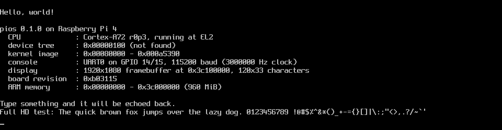

# pios

A small command-line operating system for the **Raspberry Pi 4 and 5**,
written in Rust with a little AArch64 assembly. One `kernel8.img` runs on
both: the board is detected at boot from the CPU type.

It started as the [OSDev "Raspberry Pi Bare Bones"][bare-bones] tutorial,
ported from C to Rust, and is growing into a microkernel (see
[docs/design.md](docs/design.md)). It brings up a console on the serial
port(s) and the screen, prints a greeting plus a few facts about the
machine, runs its self-tests, and then hands over to user space: `init`
starts a console server, which drives the serial ports and the screen, a
process manager, and a shell you use over the serial console:

```
Welcome to the pios shell. Type 'help' for the commands.
pios> hello from the shell
Hello from user space!
  arguments: from the shell
  ...
pios> crashtest
[crashtest was stopped by a fault: bad memory access (syndrome 0x9200000f)]
pios> help
Built-in commands:
  help     list the commands
  echo     print its arguments
  uptime   how long since the system started
  exit     leave the shell (init starts a new one)
Programs: crashtest fptest hello usertest
```



[bare-bones]: https://wiki.osdev.org/Raspberry_Pi_Bare_Bones

## Layout

| File | Purpose |
| --- | --- |
| `src/boot.s` | `_start`: parks secondary cores, relocates if needed, drops to EL1, sets up the stack and exception vectors, zeroes `.bss`, calls `kernel_main`; the exception vector table |
| `src/main.rs` | `kernel_main`, the panic handler |
| `src/board.rs` | Pi 4 / Pi 5 detection, addresses and console bring-up |
| `src/console.rs` | The kernel's console (output to every console UART and the display) and `print!`/`println!` |
| `src/framebuffer.rs` | HDMI: framebuffer from the firmware, the kernel's text console on it, and handing it over |
| `textconsole/` | The text console drawn on the framebuffer, and its 8x16 font (Spleen, generated by `tools/font/gen-font.py`), shared by the kernel and the console server |
| `pl011/`, `src/uart.rs` | The PL011 UART driver, shared by the kernel and the console server |
| `src/device.rs` | Memory, interrupt, timer and DMA handles, for drivers in user space |
| `src/pcie.rs` | The Pi 4's PCIe controller and the VL805 USB chip behind it |
| `src/gpio.rs` | BCM2711 pin function and pull-up/down configuration |
| `src/mailbox.rs` | VideoCore mailbox property interface |
| `src/timer.rs` | ARM generic timer: timeouts and the 100 Hz tick |
| `src/exception.rs` | Trap frames, `svc`/`brk` handling, register dumps for fatal exceptions |
| `src/gic.rs`, `src/irq.rs` | GIC-400 interrupt controller and interrupt dispatch |
| `src/addr.rs` | `PhysAddr`, `VirtAddr` and the kernel's linear map |
| `src/memory.rs`, `src/frames.rs`, `src/ranges.rs` | Finding RAM, the physical frame allocator, `OwnedFrame` |
| `src/paging.rs` | Page tables with typed permissions (W^X) |
| `src/mmu.rs`, `src/cache.rs` | The kernel map, TTBR switching, address probes, cache maintenance |
| `src/addrspace.rs` | User address spaces (TTBR0) |
| `src/process.rs`, `src/elf.rs` | Loading ELF programs and starting them at EL0; starting `init` |
| `src/bootimage.rs`, `bootfs/` | The boot image of user programs built into the kernel, and its format |
| `src/handle.rs`, `src/ipc.rs` | Per-process handle tables with rights; IPC endpoints and reply handles |
| `src/thread.rs`, `src/thread.s` | Threads, the context switch and the preemptive scheduler |
| `src/stack.rs` | Kernel stacks for threads, with guard pages |
| `src/syscall.rs`, `src/user.rs` | System calls, and checked access to user memory |
| `abi/` | The system call interface, shared by the kernel and user programs |
| `user/` | User programs: `libpios` (their runtime), `init`, the `console` server, the process manager (`procman`), the `shell`, the `usb` keyboard driver, `hello`, and test programs |
| `src/heap.rs`, `src/allocator.rs` | The kernel heap behind `Box`/`Vec`/`String`, and its free-list allocator |
| `src/sync.rs` | `SpinLock` (masks IRQs while held) |
| `src/fdt.rs` | Device tree parser |
| `docs/design.md` | The overall design: microkernel, IPC, capabilities, roadmap |
| `src/cpu.rs`, `src/mmio.rs` | CPU identification, volatile register access |
| `linker.ld` | Places the kernel at 0x80000 with `_start` first, then `.bss` and a 64 KiB boot stack (with a guard page) |
| `boot/config.txt` | Firmware configuration for the SD card |
| `tools/qemu-raspi5/` | A minimal Pi 5 machine for QEMU, for testing |
| `scripts/` | QEMU tests (serial and screen), SD card assembly |
| `tools/host-tests/` | Host unit tests for the plain-logic modules |

## Building

You need `rustup` (the toolchain, the `aarch64-unknown-none-softfloat` target
and `llvm-tools` are installed automatically from `rust-toolchain.toml`) and
`make`.

```sh
make            # -> kernel8.img
```

## Testing in QEMU

### Raspberry Pi 4

The `raspi4b` machine needs **QEMU 9.0 or newer** (Ubuntu 24.04 ships 8.2,
which only emulates up to the Pi 3; build QEMU from source or use a newer
distribution). Point the Makefile at a specific binary with
`make run QEMU=/path/to/qemu-system-aarch64`.

```sh
make run        # UART0 on your terminal; quit with Ctrl-C
make run QEMU_DISPLAY=gtk   # ...and the HDMI output in a window
make test       # boot, type into UART0, and check the serial and HDMI output
```

`make test-host` runs unit tests on your machine (no QEMU needed) for the
modules that are plain logic, compiled unchanged from `src/`: the heap
allocator, the frame allocator, the page tables, the device tree parser, the
ELF parser and the range set. They include randomized tests against simple
models, and for the two parsers, every truncation and single-byte corruption
of a test input (which must be rejected or handled, never crash). They also
check the real Pi 4 and Pi 5 device trees if `make sdcard` has downloaded
them, and the user programs if they have been built in `user/`.

The serial test (`scripts/qemu-test.sh`) checks the banner (including that
the kernel runs at EL1 and its exception, interrupt, memory, address space,
user mode, thread and IPC self-test passed), checks that `init` starts from
the boot image and sets up the console server, then types commands into the
shell: a built-in, a program with arguments, a program that crashes,
`help`, a pasted burst of 300 `echo` commands (12 KB) whose output must all
come back intact, and `exit`, after which `init` must start a new shell.

The HDMI test (`scripts/qemu-screen-test.sh`) types enough to make the
screen scroll, takes a screenshot through the QEMU monitor, turns the pixels
back into text by matching them against the font, and checks the screen
against the serial console transcript.

To boot with the real Pi 4 device tree (so `x0` points at a DTB, as it does on
hardware), run `make sdcard` first and then
`make run DTB=build/sdcard/bcm2711-rpi-4-b.dtb`.

### Raspberry Pi 5

QEMU has no Pi 5 machine, so `tools/qemu-raspi5/` adds a minimal one,
`raspi5-pios`: four Cortex-A76 cores numbered like the real BCM2712, the
debug UART, RP1's UART0, a GIC-400, the VideoCore mailbox at the Pi 5's address
(answered by QEMU's existing property-interface and framebuffer models),
RP1's two USB controllers (QEMU's DWC3 model, whose DMA sees RAM at RP1's
offset, so a driver that forgets it fails as it would on the Pi), and
a small fake firmware that leaves things the way the real firmware does. It
checks addresses, board detection, the boot flow and the display path; it is
not an emulation of the BCM2712 or its VideoCore VII GPU. Build QEMU with it from a QEMU
9.2 source tree:

```sh
tools/qemu-raspi5/build-qemu.sh ~/src/qemu-9.2.1 ~/qemu-pios
make test-pi5 QEMU_PI5=~/qemu-pios/bin/qemu-system-aarch64
make run-pi5  QEMU_PI5=~/qemu-pios/bin/qemu-system-aarch64
```

`test-pi5` runs the serial test on both UARTs, the HDMI test, and a USB
test (`scripts/qemu-usb-test.sh`) that plugs in QEMU's USB keyboard and
types commands into the shell on it through the QEMU monitor, including
Shift, Backspace, a held key and Ctrl-C. `run-pi5`
puts the debug UART on your terminal and writes RP1 UART0's output to
`rp1-uart0.log`; add `QEMU_DISPLAY=gtk` to see the screen.

## Running on real hardware

1. `make sdcard` builds the kernel and assembles `build/sdcard/` with
   `kernel8.img`, `config.txt`, the Pi 4 GPU firmware (`start4.elf`,
   `fixup4.dat`) and the device trees for the Pi 4, 400, 5 and 500,
   downloaded from [raspberrypi/firmware](https://github.com/raspberrypi/firmware).
   The same card boots either board.
2. Format a micro SD card with a single FAT32 partition and copy the contents
   of `build/sdcard/` onto it.
3. Connect a display to **HDMI0**, the micro HDMI port next to the USB-C
   power connector, before powering on.
4. For input, connect a 3.3 V serial adapter (see below) and open it at
   **115200 8N1** (e.g. `picocom -b 115200 /dev/ttyUSB0` or PuTTY).
5. Insert the card and power on the Pi.

The console appears on the screen and the serial port at the same time.
You can also type on a USB keyboard plugged straight into one of the USB
ports (not through a hub). On the Pi 5 this has only been tested in QEMU;
on the Pi 4 it hasn't been tested at all, as QEMU can't emulate the Pi 4's
PCIe (see [USB keyboards](#usb-keyboards)). The boot banner's `USB` line
says what the kernel found; if typing on the keyboard doesn't work, the
serial port still does.

### HDMI

pios asks the GPU firmware for a 32-bit framebuffer at the display's native
resolution and draws text on it with an 8x16 font, doubled in size on
displays 1600 pixels or wider. The banner shows the framebuffer it got and
how many displays the firmware found. The kernel draws its own boot messages;
then the console server takes over the screen, drawing with the same code
(`textconsole/`) from where the kernel left off.

Both boards' GPUs (VideoCore VI on the Pi 4, VideoCore VII on the Pi 5) run
firmware that offers this framebuffer through the documented
[mailbox property interface](https://github.com/raspberrypi/firmware/wiki/Mailbox-property-interface).
pios follows the tag sequence and pixel layout of Linux's `bcm2708_fb`
driver, which the Pi 5's device tree still enables. (Raspberry Pi OS itself
drives the display with its KMS driver, which programs the display hardware
directly; that is a much bigger job, needed only for things like
multiple displays or hardware-accelerated graphics.)

If the screen stays black, try uncommenting `hdmi_force_hotplug=1` in
`config.txt`.

The framebuffer is mapped non-cacheable (the GPU reads it straight from
memory) but write-combining, so drawing is fast while reading it back would be
slow. pios keeps its own copy of the characters on screen, never reads the
framebuffer, and redraws only the character cells that change when scrolling.

### Serial connections

**GPIO header (Pi 4 and Pi 5):** adapter **RX to pin 8** (GPIO 14, TXD),
adapter **TX to pin 10** (GPIO 15, RXD) and **GND to pin 6**. Do not connect
the adapter's power pin.

**Pi 5 debug UART connector:** the small 3-pin JST-SH socket between the two
micro HDMI ports, for example with the Raspberry Pi Debug Probe's cable. The
Pi 500 has no such connector; use the GPIO header.

On a Pi 5, pios uses both at once: the debug connector is programmed by pios
itself, and GPIO 14/15 (RP1's UART0) is set up by the firmware because
`config.txt` has `enable_rp1_uart=1` in its `[pi5]` section. Without that
line pios can't reach RP1 and only uses the debug connector.

If nothing appears, uncomment `uart_2ndstage=1` in `config.txt` to see the
firmware's own boot log (on GPIO 14/15 on a Pi 4, on the debug connector on a
Pi 5). If pios hits an unexpected exception it prints `UNHANDLED EXCEPTION`
with the exception syndrome (ESR), the addresses involved (ELR, FAR) and all
general-purpose registers.

## Exceptions and interrupts

The firmware starts pios at EL2 (the hypervisor level); `_start` drops to
EL1, where kernels normally run, after letting EL1 use the timer and turning
off EL2 traps.

Every exception saves the interrupted registers in a trap frame and calls
`exception_handler` in `src/exception.rs`, which can change the frame before
execution resumes:

- **IRQs** go to the GIC-400 driver, which dispatches each pending interrupt
  to the handler registered for its ID. If the timer tick ended the running
  thread's time slice, the scheduler then switches threads.
- **`svc`** from a user program is a system call, handled with interrupts
  enabled. From the kernel, `svc #n` just returns `x0 + n`, which the boot
  self-test uses to check the round trip.
- **`brk`** is stepped over.
- Anything else prints a register dump and stops.

Two interrupts are in use, on both boards:

- **ID 30, the EL1 physical timer**: a 100 Hz tick (`timer::tick_count`),
  which also ends each thread's time slice.
- **ID 153 (SPI 121), the console UART**: owned by the console server in
  user space, through an interrupt handle (see
  [Drivers in user space](#drivers-in-user-space-the-console-server)). On
  the Pi 5, RP1's UART0 has to be polled: RP1's interrupts arrive as PCIe
  MSIs, which pios doesn't set up yet.

SErrors (asynchronous aborts) are still masked. For instruction and data
aborts, the fatal-exception report also decodes the fault (translation fault
and its table level, permission fault, alignment fault and so on).

## Memory

See also [docs/design.md](docs/design.md) for the overall design.

### Address space

Virtual addresses are 39 bits wide in each half of the address space:

| Range | Contents | Page table |
| --- | --- | --- |
| `0x0000_0000_0000_0000` - `0x0000_007F_FFFF_FFFF` | the running process | TTBR0, one per process |
| `0xFFFF_FF80_0000_0000` - `0xFFFF_FFBF_FFFF_FFFF` | the kernel: linear map of RAM and devices | TTBR1 |
| `0xFFFF_FFC0_0000_0000` - `0xFFFF_FFFF_FFFF_FFFF` | the kernel: thread stacks | TTBR1 |

The kernel half starts with a **linear map**: physical address `p` is at
`0xFFFF_FF80_0000_0000 + p`, and the kernel is linked at its place in it
(`0xFFFF_FF80_0008_0000`). Physical and virtual addresses are different Rust
types (`PhysAddr`, `VirtAddr`), converted only through the linear map.

### Start-up

1. `boot.s` runs at the physical address the firmware loaded it to, using
   only position-independent code. It builds a small boot map (the first
   GiB of RAM and the peripherals) used both as an identity map and for the
   kernel half, turns on the MMU and caches, and jumps up into the kernel
   half.
2. Rust finds the RAM: the device tree's `/memory` nodes (or the firmware's
   figure), minus the GPU's memory and `no-map` reservations such as the Pi
   5's secure firmware (TF-A) region.
3. The **frame allocator** (`src/frames.rs`) takes all RAM except what lies
   below the end of the kernel, the device tree, and anything reserved. It
   keeps a bitmap per region and hands out 4 KiB frames, singly or in
   aligned contiguous runs. Freeing a frame twice, or one it doesn't own,
   panics.
4. The **kernel map** is built with 4 KiB pages and 2 MiB/1 GiB blocks
   (`src/paging.rs`, `src/mmu.rs`):

   | What | Mapped as |
   | --- | --- |
   | kernel code | read-execute |
   | kernel constants | read-only |
   | kernel data, boot stack, all other RAM | read-write, never executable |
   | thread stacks (mapped as threads are created) | read-write, never executable |
   | peripherals | Device, never executable |
   | framebuffer | Normal non-cacheable (write-combining) |

   The switch happens from a tiny trampoline running on the identity map,
   so the kernel half's tables never change while in use; then the identity
   map is removed and the lower half is left empty.
5. The heap takes its memory from the frame allocator.

### Guard rails

- Page permissions are typed: `Access` only offers read-only, read-write
  and read-execute, for kernel or user, so a writable and executable page
  can't be expressed. Device and non-cacheable memory is never executable.
  A page table only accepts addresses from its own half.
- Frames and page tables are owned values: an `OwnedFrame` returns itself to
  the allocator when dropped, a `PageTable` frees its tables, and an
  `AddressSpace` frees both, switching away first if it is active.
- `map` and `unmap` are all-or-nothing: on error nothing has changed.
- Every kernel stack has an unmapped guard page (16 KiB for thread stacks)
  below it. Exception entry checks the new trap frame fits above the
  running thread's stack limit; if not, it reports the overflow from a spare
  stack (`*** KERNEL STACK OVERFLOW in thread 6 (deep): ...`) instead of
  faulting again and again.
- The crate denies `unsafe` operations outside `unsafe` blocks and `unsafe`
  blocks without a `// SAFETY:` comment.

### User address spaces

`AddressSpace` (`src/addrspace.rs`) is one process's lower half: it maps
zeroed pages with user permissions (never at page 0), can be activated
(TTBR0; the whole TLB is flushed on each switch, as there are no address
space IDs yet) and frees everything when dropped. The boot self-test builds two address spaces and checks with the MMU's
address translation instruction that they are isolated, that permissions
hold from user mode and kernel mode, that kernel code isn't writable and
kernel data isn't executable, and that all memory comes back.

### Memory shared with the GPU

- The framebuffer is mapped non-cacheable, so the GPU sees what is drawn.
- Mailbox messages sit on cache lines of their own; they are cleaned to
  memory before the GPU reads them and invalidated before we read the reply.

## User programs

User programs run at EL0, each in its own address space, and talk to the
kernel through system calls. The kernel's build (`build.rs`) builds the
programs in `user/` and packs them into a **boot image** built into the
kernel (see [docs/design.md](docs/design.md#decisions) for why this rather
than a Linux-style initramfs). The boot image is a small read-only archive:
a directory, then each program on a page boundary.

At boot the kernel runs five test programs from the boot image at once as
part of its self-test. Then it starts `init`, with the whole boot image
mapped read-only into it, and `init` starts everything else: the console
server, the process manager and the shell:

```
init: starting the system from a boot image of 9 programs
init: the console server has 1 serial port(s) and the display

Welcome to the pios shell. Type 'help' for the commands.
pios>
```

### Writing one

A program is a `no_std` Rust binary in the `user/` workspace using
`libpios`:

```rust
#![no_std]
#![no_main]

libpios::pios_main!(main);

fn main() -> i32 {
    libpios::println!("hello");
    0 // the exit code
}
```

`libpios` provides the entry point, `print!`/`println!`, a panic handler
(which prints and exits with code 101), the system calls, what the program
was started with (`argument()`, `start_handle()`, and `args()` for its
command line's arguments) and the time (`counter()`, reading
the ARM generic timer's counter, which user programs may do directly). Programs are
built for `aarch64-unknown-none` (with floating point) and linked at
`0x40_0000` by `user/libpios/user.ld`, with code, constants and data on
separate pages. To add one, add it to `user/Cargo.toml` and to `PROGRAMS` in
`build.rs`, which puts it in the boot image, and the shell can run it by
name. A program the shell runs is given a console handle as its start
handle; call `libpios::console::connect(handle)` to print through it (see
`user/hello`). Programs start others with
`libpios::spawn(elf_bytes, arg, handle, args)`, which returns a `Child`:
`child.wait()` waits for it to end, and dropping it gives up the handle.

### System calls

`svc #0` with the call number in `x8` and arguments in `x0`-`x5`; the result
comes back in `x0`, negative for an error. The numbers and error codes are
defined once, in the `abi/` crate, which both sides use.

| Number | Call | |
| --- | --- | --- |
| 0 | `debug_write(ptr, len)` | write to the kernel's console (temporary: for programs without a console handle, like the kernel's test programs) |
| 1 | `exit(code)` | end the program |
| 2 | `yield()` | let other threads run for the rest of this time slice |
| 3 | `spawn(ptr, len, arg, handle, args_ptr, args_len)` | start the ELF executable in the caller's memory as a new process, passing it a number, a handle and an argument string; returns a handle to it |
| 4 | `wait(handle)` | wait for that process to end, close the handle, and return its exit code or fault |
| 5 | `close(handle)` | give up a handle |
| 6 | `endpoint()` | make an IPC endpoint; returns a handle to it with every right |
| 7 | `duplicate(handle, rights, badge)` | copy an endpoint handle with the same or fewer rights, perhaps stamping a badge |
| 8 | `send(endpoint, message)` | send a message, waiting until it is received |
| 9 | `call(endpoint, message)` | send a message and wait for the reply |
| 10 | `receive(endpoint, message)` | wait for a message |
| 11 | `reply(reply, message)` | answer a call, using up its reply handle |
| 12 | `map(memory, address)` | map memory from a memory handle (device registers, a framebuffer, read-only data) |
| 13 | `interrupt_bind(interrupt, endpoint, badge)` | deliver an interrupt as notifications on an endpoint |
| 14 | `interrupt_ack(interrupt)` | unmask an interrupt once the device is dealt with |
| 15 | `timer(endpoint, badge, period_ms)` | notify an endpoint periodically, until the handle is closed |
| 16 | `dma_alloc(dma, address, pages)` | map fresh uncached memory for a device's DMA; returns the address the device sees it at |

### Handles and IPC

Handles are numbers in a per-process table the kernel keeps, so they can't
be forged, and each carries rights (send, receive, duplicate, transfer,
wait) that the system calls check. Copies can have fewer rights, never
more. `spawn` can pass the new process one handle, to start talking to it.

IPC is synchronous, as in L4, seL4 and QNX: a client *calls* an endpoint
and waits; a server *receives*, then *replies* through the one-shot reply
handle that came with the call. A message is a label, 12 data words and at
most one handle, which moves to the receiver. A server can give each client
a **badged** copy of its endpoint handle, and messages through it arrive
stamped with that badge, so it knows who is calling. If every handle on
one side of an endpoint closes, or a server drops a reply handle without
replying, whoever is waiting on the other side gets `PeerGone` instead of
waiting forever. The design and its gaps are in
[docs/design.md](docs/design.md#ipc).

In `libpios`, a `Handle` closes itself when dropped, sending a handle in a
`Message` moves it, and a `Reply` is used up by replying:

```rust
let server = libpios::endpoint()?;
let client = server.duplicate(rights::SEND, 42)?; // give this to a client

// In the client:
let answer = client.call(Message::new(ADD, &[2, 3]))?;

// In the server:
let request = server.receive()?; // request.badge == 42
if let Some(reply) = request.reply {
    let [a, b, ..] = request.message.data;
    reply.reply(Message::new(OK, &[a + b]))?;
}
```

### Protection

- **Loading.** The ELF loader (`src/elf.rs`) checks everything before
  loading: segments inside user space, file data inside the file, no
  segment both writable and executable, no two segments sharing a page, the
  entry point in code. Each segment is mapped with the permissions its flags
  ask for, plus a 64 KiB stack with an unmapped guard page below it.
- **Starting.** Every register (general purpose, FP/SIMD, FPCR/FPSR and
  TPIDR_EL0) is cleared before the program starts, apart from its argument
  in `x0`, so nothing leaks into it from the kernel or other programs.
- **Pointers.** A pointer passed to a system call is only used after the
  MMU confirms, page by page, that the program itself could read it
  (`UserSlice` in `src/user.rs`). Kernel addresses, unmapped memory and
  ranges that wrap around are refused with `BadAddress`.
- **Faults.** A program that faults (bad memory access, undefined
  instruction, ...) is stopped and reported, and the kernel carries on.

The self-test's `usertest` program checks the system calls from user space
(including that bad pointers are refused, and that a long computation comes
out right while timer interrupts arrive), and `crashtest` reads kernel
memory, which must stop it with a fault. `ipctest` runs as two processes
that call each other, pass handles, and check that badges arrive, rights
are enforced, reply handles work once, and closing one side wakes the
other with `PeerGone`; the kernel then checks no endpoint was leaked.

## Drivers in user space: the console server

After its self-test the kernel hands its console hardware to `init`: a
memory handle for each console UART's registers, an interrupt handle for
each UART that has one, a memory handle for the framebuffer, and a read-only
copy of the text on the screen. A `BootInfo` page mapped into `init` says
which handle is which. From then on the kernel reads no input and draws
nothing (except a panic report, when it takes the screen back); it still
writes its own messages to the UARTs.

`init` starts the console server (`user/console`) and passes it that
hardware in set-up messages, then gives every other program a send-only
handle to the server, which `libpios` uses for `print!`. The server:

- maps the UARTs' registers and the framebuffer, and carries on drawing
  with the same text console code as the kernel (`textconsole/`), from
  where the kernel left off, so the screen goes on seamlessly;
- binds each UART interrupt to its endpoint. The kernel masks an interrupt
  when it arrives and notifies the server, which empties the UART's FIFO
  into a 4 KiB buffer and acknowledges it. While the buffer is full it
  leaves the interrupt masked, so the bytes wait in the UART instead of
  being lost. A UART without an interrupt (RP1's on the Pi 5) is polled on
  a 10 ms timer;
- answers `WRITE` requests by writing to every UART and the screen, and
  `READ` requests from the buffer. A reader with nothing to read simply
  isn't answered yet: the server keeps its reply handle until input comes.
  It tells notifications, `init`'s set-up and clients apart by badge.


A polled UART is only checked every 10 ms, so on real hardware a fast
paste into RP1's UART0 can overflow its FIFO; the Pi 5's debug UART is
interrupt-driven and doesn't have this problem.

## USB keyboards

USB lives behind PCIe on both boards: on the Pi 5, RP1 has two xHCI USB
controllers (Synopsys DWC3s); on the Pi 4, a VL805 xHCI chip hangs off the
BCM2711's PCIe controller. The kernel makes the controllers reachable, then
hands `init` each one's registers and a **DMA handle**, and `init` starts a
USB driver (`user/usb`) for each:

- **Pi 5**: the firmware leaves the PCIe link to RP1 up, so there is
  nothing to do.
- **Pi 4** (`src/pcie.rs`): the kernel brings up the PCIe controller the way
  Linux's `pcie-brcmstb` driver does: reset, the inbound window (PCIe
  address = physical address, and DMA kept below 3 GiB, as the device tree
  says) and the outbound one (the VL805's registers at CPU address
  0x6_0000_0000), link training, then the bridge and the VL805's BAR. It
  then asks the firmware to load the VL805's firmware, as Linux does. QEMU
  has no model of this controller, so **this is untested**. Every step has a
  timeout, and a failure leaves USB off rather than stopping the boot; the
  first register read is a *probe* (a read the exception handler is
  allowed to abort), so a missing controller, as in QEMU, is noticed rather
  than crashing the kernel.

A DMA handle lets a driver ask for memory a device can use: physically
contiguous, zeroed, uncached (so there is no cache maintenance to get
wrong), below the highest address the device can reach, and with the
address the device sees it at. RP1 sees RAM through PCIe at 0x10_0000_0000
plus its physical address. With no IOMMU, a DMA handle is as powerful as
the device, so only drivers get one.

The driver:

- resets the controller (putting the DWC3 into host mode first) and sets
  up its command and event rings;
- checks the root ports twice a second: when something is plugged in it
  resets the port, gives the device an address, reads its descriptors and,
  if it has a boot keyboard interface, configures it and asks for its
  reports; it frees the slot when it is unplugged;
- turns key presses into bytes with a US layout (Shift, Caps Lock, Ctrl
  with a letter, Enter, Backspace, Tab, Esc), repeats a held key after half
  a second, and sends what is typed to the console server as input, where
  it mixes with the serial ports' input.

Everything is polled every 10 ms: the controllers' interrupts are PCIe MSIs,
which pios doesn't set up yet. Not yet supported: hubs (a keyboard must be
plugged straight into the Pi), keyboards that only work with their full
HID report protocol, the arrow and function keys, keyboard LEDs, and other
layouts.

## The process manager and the shell

The **process manager** (`user/procman`) starts programs by name. `init`
gives it a read-only memory handle to the boot image (which the kernel
handed `init`) and a console handle it can copy. Asked to run a command
line, it finds the program, starts it with a copy of the console handle
and the rest of the line as its arguments, and hands the caller the new
process's handle to wait on. It only offers the programs that work when
started that way: not `init`, the servers or the shell, nor the kernel's IPC
self-test.

The **shell** (`user/shell`) gets a handle to the process manager, and its
console from it. It reads a line at a time (Backspace/Delete erase, Ctrl-C
abandons the line), echoing as you type, and runs built-ins (`help`,
`echo`, `uptime`, `exit`) itself and everything else through the process
manager, waiting for it and reporting an exit code other than 0, or a
fault. `init` keeps a shell running, starting a new one when one exits.

The kernel copies a program's argument string (up to 1 KiB, passed to
`spawn`) to the top of its new stack, like `argv`, and `libpios::args()`
returns it.

## Threads and scheduling

Each process has one thread for now (`src/thread.rs`); the kernel has its
own threads too: `kernel` (what `kernel_main` becomes once the scheduler
starts, running the self-test and starting `init`) and `idle`. Every
thread has its own 16 KiB kernel stack.

- **Preemptive, round-robin.** Every 100 Hz timer tick ends the running
  thread's time slice and the next ready thread runs. Threads can also
  `yield_now`, `park` until something calls `unpark` for them (IPC waits
  this way), or `exit`. When
  nothing is ready the idle thread waits in `wfi`.
- **The context switch** (`src/thread.s`) saves the callee-saved registers,
  the stack pointer, TPIDR_EL0, FPCR/FPSR and all 32 128-bit FP/SIMD
  registers. The kernel is built without floating point, so the FP/SIMD
  registers always hold the user thread's values. A user thread's other
  registers, including its stack pointer (SP_EL0), are in the trap frame on
  its kernel stack. Each thread also has its own lower-half page tables, set
  on the way in.
- **Finishing.** `exit` records how the thread ended and wakes whoever is
  joining it; the next thread to run frees its stack (and its process's
  memory), since nothing can free the stack it is running on.
  `JoinHandle::join` returns the exit code or the fault.

The boot self-test runs `usertest`, `crashtest` and two `fptest`s together.
Each `fptest` fills every FP/SIMD register, FPCR, FPSR and TPIDR_EL0 with
values from its argument, spins for a couple of time slices so the other
takes turns with it, and checks nothing changed. The self-test also checks
the programs were preempted, and that every thread and page came back.

## Heap

The kernel can use `alloc` (`Box`, `Vec`, `String`, `BTreeMap`, `format!`).
The heap is a contiguous block from the frame allocator: a sixteenth of free
RAM, between 4 and 64 MiB.

The allocator (`src/allocator.rs`) is a first-fit free list: free blocks
are kept in address order, each storing its size and the next block's
address in its own first 16 bytes; allocation takes the first block that
fits, and freeing merges the block with free neighbours. All sizes and
addresses are multiples of 16 bytes. A `SpinLock` guards it, masking IRQs
while held so an interrupt handler could allocate safely.

Running out of memory panics with the size that failed. The boot self-test
exercises the standard collections, a page-aligned allocation and a
pattern-checked random stress run, and checks that all the memory comes back
afterwards.

## Pi 4 vs Pi 5

| | Pi 4 (BCM2711) | Pi 5 (BCM2712) |
| --- | --- | --- |
| CPU | Cortex-A72; cores numbered in MPIDR Aff0 | Cortex-A76; cores numbered in MPIDR Aff1 |
| Peripherals | 0xFE00_0000 | 0x10_7C00_0000 (SoC), 0x1F_0000_0000 (RP1 via PCIe) |
| Console | UART0 on GPIO 14/15 | debug UART (fixed 9.216 MHz clock) + RP1 UART0 on GPIO 14/15 |
| Mailbox | 0xFE00_B880 | 0x10_7C01_3880 |
| Interrupt controller | GIC-400 at 0xFF84_1000 | GIC-400 at 0x10_7FFF_9000 |
| Console UART interrupt | ID 153 (UART0) | ID 153 (debug UART); RP1 UART0 polled |
| GPU | VideoCore VI | VideoCore VII |
| HDMI | firmware framebuffer via the mailbox | the same |
| USB | VL805 xHCI behind the BCM2711's PCIe, brought up by the kernel (untested) | two DWC3 xHCIs in RP1, behind PCIe (tested in QEMU) |
| Below 0x80000 | firmware's spin tables | reserved for TF-A (secure firmware) |

Because TF-A owns the memory below the kernel on the Pi 5, the stack lives
after the kernel image rather than below it.

## Credits

The display font is [Spleen](https://github.com/fcambus/spleen) 8x16 by
Frederic Cambus, under the BSD 2-Clause licence (`tools/font/LICENSE.spleen`).

## Differences from the C tutorial

- **Pi 4 GPIO pulls.** The tutorial uses the `GPPUD`/`GPPUDCLK0` sequence,
  which does not exist on the BCM2711. We use the Pi 4's
  `GPIO_PUP_PDN_CNTRL_REG0` instead, and we also explicitly select ALT0 for
  GPIO 14/15, because the Pi 4 firmware routes those pins to the mini UART by
  default.
- **Board selection.** The tutorial takes the board as a parameter (and calls
  `uart_init(2)`, which would not work on a Pi 4). We detect the board from
  the CPU type.
- **Baud rate divisor.** Rather than hard-coding the divisor for a 3 MHz clock,
  we compute it from the clock rate the firmware reports back from the
  mailbox call (falling back to the 48 MHz default).
- **Interrupts.** `IMSC` is set to 0 (all UART interrupts disabled). In the
  PL011 a 1 bit *enables* an interrupt source, so the tutorial's "mask all"
  write actually enables them.
- **Device tree.** On AArch64 the firmware passes the DTB address in `x0`
  (there are no ATAGs); `_start` forwards it to `kernel_main`.
- **Soft-float target.** We build for `aarch64-unknown-none-softfloat` so no
  FP/SIMD instructions are emitted before we have set up the FPU trap
  controls.
